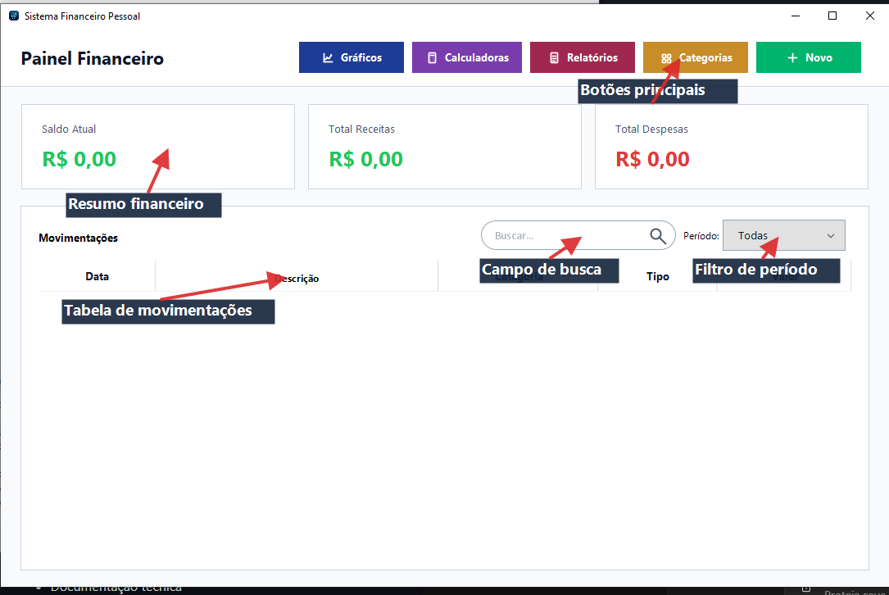

# Manual do Usuário - NEXA

## 1. Visão geral

O NEXA é um sistema financeiro pessoal desktop desenvolvido em Java. Ele funciona 100% offline e ajuda o usuário a controlar receitas, despesas, categorias, saldo, relatórios, gráficos e simulações financeiras.

O sistema armazena os dados localmente no computador do usuário, por isso não depende de internet para cadastrar ou consultar informações.

### Como abrir o sistema

1. Abra o projeto no NetBeans ou em outra IDE Java.
2. Execute a classe `com.sistema.Main`.
3. Aguarde a tela principal abrir com o nome `Sistema Financeiro Pessoal`.

Também é possível abrir pelo terminal:

1. Entre na pasta `java-project`.
2. Execute `mvn exec:java`.

### Dados de demonstração

Para preencher o sistema com dados fictícios de teste, execute a classe `com.sistema.util.DemoDataSeeder`. Ela cria categorias, receitas e despesas de exemplo quando o banco `financeiro.db` ainda não possui transações.

## 2. Tela Principal - Painel Financeiro

Esta é a primeira tela do sistema. Ela mostra o resumo financeiro e a lista de movimentações cadastradas.

### O que aparece na tela

- Card `Saldo Atual`: mostra receitas menos despesas.
- Card `Total Receitas`: soma todas as receitas exibidas no filtro atual.
- Card `Total Despesas`: soma todas as despesas exibidas no filtro atual.
- Tabela `Movimentações`: mostra data, descrição, categoria, tipo e valor.
- Campo de busca: pesquisa por data, descrição, categoria, tipo ou valor.
- Filtro `Período`: filtra por todas as movimentações, últimos dias, mês específico ou ano específico.
- Botões principais: `Gráficos`, `Calculadoras`, `Relatórios`, `Categorias` e `Novo`.

### Indicação das áreas da tela

- Parte superior esquerda: título `Painel Financeiro`, indicando que o usuário está na tela principal.
- Parte superior direita: botões de acesso rápido para `Gráficos`, `Calculadoras`, `Relatórios`, `Categorias` e `Novo`.
- Faixa central: cards de resumo com `Saldo Atual`, `Total Receitas` e `Total Despesas`.
- Área inferior: tabela `Movimentações`, onde aparecem os lançamentos cadastrados.
- Campo `Buscar`: usado para localizar movimentações rapidamente.
- Filtro `Período`: usado para mostrar somente os registros do período escolhido.

### Como usar o painel

1. Abra o sistema.
2. Confira os cards de saldo, receitas e despesas.
3. Veja as movimentações na tabela.
4. Use a busca ou o filtro de período para encontrar registros específicos.
5. Dê duplo clique em uma movimentação para editar ou excluir.

## 3. Menu Novo

O botão `Novo` abre as opções de cadastro de transação.

### Opções do menu

- `Nova Receita`: abre a tela para cadastrar entrada de dinheiro.
- `Nova Despesa`: abre a tela para cadastrar saída de dinheiro.

### Como usar

1. Na tela principal, clique em `Novo`.
2. Escolha `Nova Receita` ou `Nova Despesa`.
3. Preencha os dados da transação.
4. Clique em `Salvar`.

## 4. Tela Nova Receita

Esta tela serve para cadastrar uma receita, como salário, pagamento de cliente, venda ou qualquer entrada de dinheiro.

### Campos da tela

- `Tipo`: fica como `Receita`.
- `Descrição`: nome ou explicação da receita.
- `Valor (R$)`: valor recebido.
- `Data (dd/MM/yyyy)`: data da receita.
- `Categoria`: categoria relacionada à receita.

### Como cadastrar uma receita

1. Clique em `Novo`.
2. Escolha `Nova Receita`.
3. Digite a descrição da receita.
4. Informe o valor.
5. Informe a data ou use o botão de calendário.
6. Escolha uma categoria de receita, se houver.
7. Clique em `Salvar`.
8. Confira a mensagem de sucesso.

## 5. Tela Nova Despesa

Esta tela serve para cadastrar uma despesa, como mercado, conta de luz, transporte, aluguel ou qualquer saída de dinheiro.

### Campos da tela

- `Tipo`: fica como `Despesa`.
- `Descrição`: nome ou explicação da despesa.
- `Valor (R$)`: valor gasto.
- `Data (dd/MM/yyyy)`: data da despesa.
- `Categoria`: categoria relacionada à despesa.

### Como cadastrar uma despesa

1. Clique em `Novo`.
2. Escolha `Nova Despesa`.
3. Digite a descrição da despesa.
4. Informe o valor.
5. Informe a data ou use o botão de calendário.
6. Escolha uma categoria de despesa, se houver.
7. Clique em `Salvar`.
8. Confira a mensagem de sucesso.

## 6. Tela Editar Transação

Esta tela abre quando o usuário dá duplo clique em uma movimentação da tabela principal.

### O que pode ser feito

- Alterar tipo, descrição, valor, data e categoria.
- Atualizar uma receita ou despesa já cadastrada.
- Excluir uma transação existente.

### Como editar uma transação

1. Na tela principal, encontre a movimentação desejada.
2. Dê duplo clique na linha da tabela.
3. Altere os campos necessários.
4. Clique em `Atualizar`.
5. Confira a mensagem de sucesso.

### Como excluir uma transação

1. Abra a transação com duplo clique.
2. Clique em `Excluir`.
3. Confirme a exclusão.
4. Confira a mensagem de sucesso.

## 7. Seletor de Data

Algumas telas possuem um pequeno botão ao lado do campo de data. Ele abre um calendário para facilitar a escolha da data.

### Como usar

1. Clique no botão de calendário ao lado do campo `Data`.
2. Use os botões de navegação para mudar de mês, se necessário.
3. Clique no dia desejado.
4. A data será preenchida automaticamente no campo.

## 8. Tela Categorias

Esta tela serve para cadastrar e excluir categorias usadas nas receitas e despesas.

### O que aparece na tela

- Campo para digitar o nome da categoria.
- Seletor de tipo: `Receita` ou `Despesa`.
- Lista de categorias cadastradas.
- Botão `Adicionar`.
- Botão `Excluir Selecionada`.
- Botão `Fechar`.

### Como cadastrar uma categoria

1. Na tela principal, clique em `Categorias`.
2. Escolha o tipo da categoria: `Receita` ou `Despesa`.
3. Digite o nome da categoria.
4. Clique em `Adicionar`.
5. Confira a mensagem de sucesso.

### Como excluir uma categoria

1. Abra a tela `Categorias`.
2. Escolha o tipo para listar as categorias.
3. Selecione a categoria desejada.
4. Clique em `Excluir Selecionada`.
5. Confirme a exclusão.

Se a categoria estiver vinculada a alguma transação, o sistema exibirá um aviso e não fará a exclusão.

## 9. Menu Gráficos

O botão `Gráficos` abre opções para visualizar gráficos mensais.

### Opções do menu

- `Despesa Mensal`: mostra as despesas por mês.
- `Receita Mensal`: mostra as receitas por mês.

### Como abrir um gráfico

1. Na tela principal, clique em `Gráficos`.
2. Escolha `Despesa Mensal` ou `Receita Mensal`.
3. Analise o gráfico exibido.
4. Clique em `Fechar` para voltar ao painel.

## 10. Tela Gráfico de Despesa Mensal

Esta tela mostra a soma das despesas por mês. No cabeçalho aparece `Despesas por Mês`, junto com o total calculado.

### Como usar

1. Abra o menu `Gráficos`.
2. Clique em `Despesa Mensal`.
3. Observe os meses e os valores apresentados no gráfico.
4. Use o resultado para identificar em quais meses houve mais gastos.

## 11. Tela Gráfico de Receita Mensal

Esta tela mostra a soma das receitas por mês. No cabeçalho aparece `Receitas por Mês`, junto com o total calculado.

### Como usar

1. Abra o menu `Gráficos`.
2. Clique em `Receita Mensal`.
3. Observe os meses e os valores apresentados no gráfico.
4. Use o resultado para comparar a evolução das entradas de dinheiro.

## 12. Tela Relatórios

Esta tela gera um relatório financeiro por período.

### O que aparece na tela

- Campo `De`: data inicial do período.
- Campo `Até`: data final do período.
- Botão `Filtrar`.
- Resumo com receitas, despesas e saldo do período.
- Tabela com as transações encontradas.
- Botão `Exportar para PDF`.
- Botão `Fechar`.

### Como consultar um relatório

1. Na tela principal, clique em `Relatórios`.
2. Informe a data inicial no campo `De`.
3. Informe a data final no campo `Até`.
4. Clique em `Filtrar`.
5. Confira os totais e a lista de transações.

### Como exportar para PDF

1. Gere um relatório usando um período.
2. Clique em `Exportar para PDF`.
3. Escolha o local onde o arquivo será salvo.
4. Digite o nome do arquivo.
5. Confirme a exportação.

Se já existir um arquivo com o mesmo nome, o sistema perguntará se deseja substituir.

## 13. Tela Calculadoras

O botão `Calculadoras` abre uma tela com as simulações financeiras disponíveis.

### Calculadoras disponíveis

- `Juros Compostos`.
- `Calculadora de Renda`.
- `Primeiro Milhão`.

### Como abrir uma calculadora

1. Na tela principal, clique em `Calculadoras`.
2. Localize a calculadora desejada.
3. Clique em `Abrir` no card da calculadora.
4. Preencha os campos.
5. Clique em `Calcular`.

## 14. Calculadora de Juros Compostos

Esta tela simula o crescimento de um investimento com valor inicial, aporte mensal, taxa de juros e período.

### Campos da tela

- `Valor inicial (R$)`: dinheiro investido no começo.
- `Aporte mensal (R$)`: valor aplicado todo mês.
- `Taxa de juros mensal (%)`: rendimento mensal esperado.
- `Período`: quantidade de meses ou anos.
- `Montante final`: resultado final da simulação.
- `Juros ganhos`: diferença entre o total investido e o montante final.
- Gráfico de evolução do investimento.

### Como usar

1. Abra `Calculadoras`.
2. Escolha `Juros Compostos`.
3. Informe o valor inicial.
4. Informe o aporte mensal.
5. Informe a taxa de juros mensal.
6. Informe o período.
7. Escolha se o período está em `Meses` ou `Anos`.
8. Clique em `Calcular`.
9. Confira o montante final, os juros ganhos e o gráfico.
10. Clique em `Limpar` para apagar os campos ou em `Fechar` para sair.

## 15. Calculadora de Renda

Esta tela mostra por quanto tempo um patrimônio pode sustentar retiradas mensais.

### Campos da tela

- `Capital inicial (R$)`: valor total disponível.
- `Taxa de juros mensal (%)`: rendimento mensal esperado.
- `Retirada mensal (R$)`: valor que será retirado todo mês.
- `Tempo até acabar`: tempo estimado para o dinheiro acabar.
- `Saldo final`: saldo restante no fim da simulação.
- Gráfico de evolução do saldo.

### Como usar

1. Abra `Calculadoras`.
2. Escolha `Calculadora de Renda`.
3. Informe o capital inicial.
4. Informe a taxa de juros mensal.
5. Informe a retirada mensal.
6. Clique em `Calcular`.
7. Confira o tempo estimado e o gráfico.
8. Clique em `Limpar` para apagar os campos ou em `Fechar` para sair.

Se o rendimento mensal for suficiente para cobrir a retirada, o sistema informará que o patrimônio nunca se esgota.

## 16. Calculadora Primeiro Milhão

Esta tela calcula quanto tempo falta para atingir R$ 1.000.000,00.

### Campos da tela

- `Capital inicial (R$)`: valor já acumulado.
- `Aporte mensal (R$)`: valor que será investido todo mês.
- `Taxa de juros mensal (%)`: rendimento mensal esperado.
- `Tempo necessário`: tempo estimado para chegar a R$ 1.000.000,00.
- `Patrimônio final`: patrimônio projetado.
- Gráfico de evolução do patrimônio.

### Como usar

1. Abra `Calculadoras`.
2. Escolha `Primeiro Milhão`.
3. Informe o capital inicial.
4. Informe o aporte mensal.
5. Informe a taxa de juros mensal.
6. Clique em `Calcular`.
7. Confira o tempo necessário e o patrimônio final.
8. Clique em `Limpar` para apagar os campos ou em `Fechar` para sair.

## 17. Busca e Filtros da Tela Principal

### Como buscar movimentações

1. Na tela principal, clique no campo de busca acima da tabela.
2. Digite uma data, descrição, categoria, tipo ou valor.
3. A tabela será atualizada automaticamente.

### Como filtrar por período

1. Na tela principal, localize o filtro `Período`.
2. Escolha uma das opções:
   - `Todas`.
   - `Últimos 30 dias`.
   - `Últimos 60 dias`.
   - `Últimos 90 dias`.
   - `Mês específico`.
   - `Ano específico`.
3. Se escolher `Mês específico`, selecione o mês e o ano.
4. Se escolher `Ano específico`, selecione o ano.
5. Confira a tabela e os cards atualizados.

## 18. Validações e Mensagens

O sistema mostra avisos quando alguma informação está incorreta ou incompleta.

### Principais validações

- Campos obrigatórios não podem ficar vazios.
- Valores devem ser válidos e maiores que zero quando necessário.
- Datas devem seguir o formato `dd/MM/yyyy`.
- A data inicial do relatório não pode ser maior que a data final.
- Categorias duplicadas não são aceitas.
- Categorias vinculadas a transações não podem ser excluídas.
- Transações excluídas pedem confirmação antes da remoção.

## 19. Como Sair do Sistema

1. Clique no `X` da janela principal.
2. Quando aparecer a confirmação, clique em `Sim`.
3. O sistema será fechado.

## 20. Dicas de Uso

- Cadastre as categorias antes de cadastrar receitas e despesas.
- Use nomes claros nas descrições, como `Salário`, `Mercado`, `Conta de luz` ou `Freelance`.
- Consulte os relatórios para conferir períodos específicos.
- Use os gráficos para comparar receitas e despesas ao longo dos meses.
- Use as calculadoras para simular investimentos, retiradas e metas financeiras.
