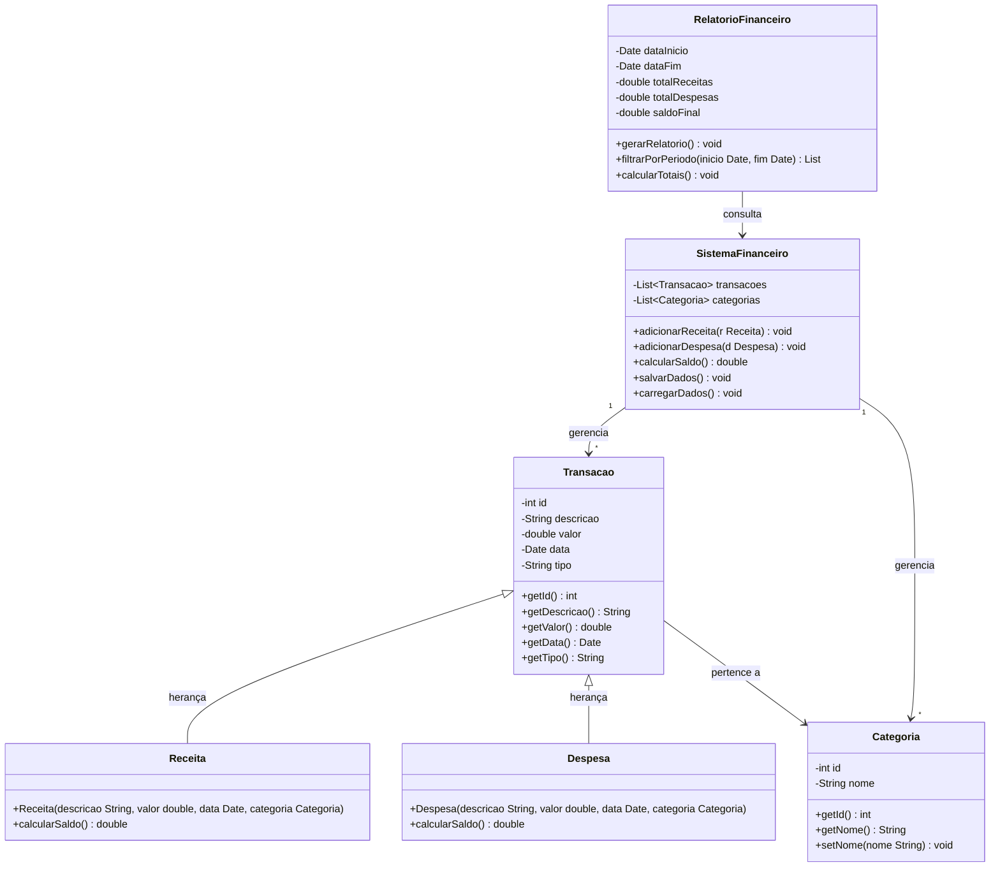

# Diagrama de Classes — Sistema Financeiro Pessoal

---

## Diagrama de Classes

---

## Dicionário de Dados

### Classe `Transacao` (abstrata — classe pai)

| Atributo | Tipo | Descrição |
|---|---|---|
| id | int | Identificador único da transação |
| descricao | String | Descrição textual da transação |
| valor | double | Valor monetário da transação |
| data | Date | Data em que a transação ocorreu |
| tipo | String | Tipo: `"RECEITA"` ou `"DESPESA"` |

---

### Classe `Receita` (herda de `Transacao`)

| Atributo / Método | Tipo | Descrição |
|---|---|---|
| Receita(...) | Construtor | Cria uma nova receita com descrição, valor, data e categoria |
| calcularSaldo() | double | Retorna o valor positivo da receita para o cálculo do saldo |

---

### Classe `Despesa` (herda de `Transacao`)

| Atributo / Método | Tipo | Descrição |
|---|---|---|
| Despesa(...) | Construtor | Cria uma nova despesa com descrição, valor, data e categoria |
| calcularSaldo() | double | Retorna o valor negativo da despesa para o cálculo do saldo |

---

### Classe `Categoria`

| Atributo | Tipo | Descrição |
|---|---|---|
| id | int | Identificador único da categoria |
| nome | String | Nome da categoria (ex: Alimentação, Transporte, Lazer, Moradia) |

---

### Classe `SistemaFinanceiro`

| Atributo / Método | Tipo | Descrição |
|---|---|---|
| transacoes | List\<Transacao\> | Lista de todas as receitas e despesas cadastradas |
| categorias | List\<Categoria\> | Lista de categorias disponíveis |
| adicionarReceita(r) | void | Adiciona uma receita à lista e salva os dados |
| adicionarDespesa(d) | void | Adiciona uma despesa à lista e salva os dados |
| calcularSaldo() | double | Retorna `totalReceitas - totalDespesas` |
| salvarDados() | void | Persiste os dados em arquivo local |
| carregarDados() | void | Carrega os dados do arquivo local ao iniciar o sistema |

---

### Classe `RelatorioFinanceiro`

| Atributo | Tipo | Descrição |
|---|---|---|
| dataInicio | Date | Data inicial do período do relatório |
| dataFim | Date | Data final do período do relatório |
| totalReceitas | double | Soma de todas as receitas no período |
| totalDespesas | double | Soma de todas as despesas no período |
| saldoFinal | double | Resultado: `totalReceitas - totalDespesas` |
| gerarRelatorio() | void | Gera e exibe o relatório financeiro |
| filtrarPorPeriodo(...) | List | Retorna transações entre dataInicio e dataFim |
| calcularTotais() | void | Calcula e preenche totalReceitas, totalDespesas e saldoFinal |
