# Diagrama de Classes — Sistema Financeiro Pessoal (NEXA)

---

## Diagrama de Classes

```mermaid
classDiagram
  direction TB

  class TipoTransacao {
    <<enumeration>>
    RECEITA
    DESPESA
    +getDescricao() String
    +toString() String
  }

  class Categoria {
    -Long id
    -String nome
    -TipoTransacao tipo
    -List~Transacao~ transacoes
    +getId() Long
    +getNome() String
    +setNome(nome String) void
    +getTipo() TipoTransacao
    +setTipo(tipo TipoTransacao) void
    +getTransacoes() List~Transacao~
  }

  class Transacao {
    -Long id
    -String descricao
    -BigDecimal valor
    -LocalDate data
    -TipoTransacao tipo
    -Categoria categoria
    +getId() Long
    +getDescricao() String
    +setDescricao(descricao String) void
    +getValor() BigDecimal
    +setValor(valor BigDecimal) void
    +getData() LocalDate
    +setData(data LocalDate) void
    +getTipo() TipoTransacao
    +setTipo(tipo TipoTransacao) void
    +getCategoria() Categoria
    +setCategoria(categoria Categoria) void
  }

  class GenericDAO~T~ {
    <<interface>>
    +salvar(entity T) T
    +atualizar(entity T) T
    +excluir(id Long) void
    +buscarPorId(id Long) Optional~T~
    +listarTodos() List~T~
  }

  class BaseDAOImpl~T~ {
    <<abstract>>
    #EntityManagerFactory emf
    +salvar(entity T) T
    +atualizar(entity T) T
    +excluir(id Long) void
    +buscarPorId(id Long) Optional~T~
    +listarTodos() List~T~
  }

  class TransacaoDAO {
    +listarOrdenadoPorData() List~Transacao~
    +listarUltimas(limite int) List~Transacao~
    +filtrarPorPeriodo(inicio LocalDate, fim LocalDate) List~Transacao~
    +filtrarPorPeriodoETipo(inicio LocalDate, fim LocalDate, tipo TipoTransacao) List~Transacao~
    +totalReceitas() BigDecimal
    +totalDespesas() BigDecimal
    +somarPorTipoEPeriodo(tipo TipoTransacao, inicio LocalDate, fim LocalDate) BigDecimal
  }

  class CategoriaDAO {
    +listarOrdenadoPorNome() List~Categoria~
    +listarPorTipo(tipo TipoTransacao) List~Categoria~
    +buscarPorNome(nome String) Optional~Categoria~
    +possuiTransacoes(id Long) boolean
  }

  class GenericController~T~ {
    <<interface>>
    +salvar(entity T) T
    +atualizar(entity T) T
    +excluir(id Long) void
    +buscarPorId(id Long) Optional~T~
    +listarTodos() List~T~
  }

  class TransacaoController {
    -TransacaoDAO transacaoDAO
    +salvar(transacao Transacao) Transacao
    +atualizar(transacao Transacao) Transacao
    +excluir(id Long) void
    +buscarPorId(id Long) Optional~Transacao~
    +listarTodos() List~Transacao~
    +calcularSaldoAtual() BigDecimal
    +totalReceitas() BigDecimal
    +totalDespesas() BigDecimal
    +calcularSaldoPeriodo(inicio LocalDate, fim LocalDate) BigDecimal
    +listarUltimas(limite int) List~Transacao~
    +filtrarPorPeriodo(inicio LocalDate, fim LocalDate) List~Transacao~
    +filtrarPorPeriodoETipo(inicio LocalDate, fim LocalDate, tipo TipoTransacao) List~Transacao~
    +gerarResumo(inicio LocalDate, fim LocalDate) ResumoFinanceiro
  }

  class ResumoFinanceiro {
    <<record>>
    +LocalDate inicio
    +LocalDate fim
    +BigDecimal totalReceitas
    +BigDecimal totalDespesas
    +BigDecimal saldo
    +List~Transacao~ transacoes
  }

  class CategoriaController {
    -CategoriaDAO categoriaDAO
    +salvar(categoria Categoria) Categoria
    +atualizar(categoria Categoria) Categoria
    +excluir(id Long) void
    +buscarPorId(id Long) Optional~Categoria~
    +listarTodos() List~Categoria~
    +listarPorTipo(tipo TipoTransacao) List~Categoria~
    +salvarPorNome(nome String, tipo TipoTransacao) Categoria
  }

  class HibernateUtil {
    <<utility>>
    -EntityManagerFactory emf
    +getEntityManagerFactory() EntityManagerFactory
    +shutdown() void
  }

  class MainView {
    <<JFrame>>
    -TransacaoController transacaoController
    +atualizarDashboard() void
  }

  class TransactionFormView {
    <<JDialog>>
    -TransacaoController transacaoController
    -CategoriaController categoriaController
  }

  class CategoryView {
    <<JDialog>>
    -CategoriaController categoriaController
  }

  class ReportView {
    <<JDialog>>
    -TransacaoController transacaoController
    +gerarRelatorio() void
  }

  %% Relacionamentos de modelo
  Transacao --> TipoTransacao : tipo
  Transacao --> Categoria : categoria (ManyToOne)
  Categoria --> TipoTransacao : tipo
  Categoria "1" --> "*" Transacao : transacoes (OneToMany)

  %% Herança DAO
  GenericDAO~T~ <|.. BaseDAOImpl~T~ : implements
  BaseDAOImpl~T~ <|-- TransacaoDAO : extends
  BaseDAOImpl~T~ <|-- CategoriaDAO : extends

  %% Herança Controller
  GenericController~T~ <|.. TransacaoController : implements
  GenericController~T~ <|.. CategoriaController : implements

  %% Dependências Controller → DAO
  TransacaoController --> TransacaoDAO : usa
  CategoriaController --> CategoriaDAO : usa

  %% Controller produz ResumoFinanceiro
  TransacaoController ..> ResumoFinanceiro : cria

  %% Views → Controllers
  MainView --> TransacaoController : usa
  TransactionFormView --> TransacaoController : usa
  TransactionFormView --> CategoriaController : usa
  CategoryView --> CategoriaController : usa
  ReportView --> TransacaoController : usa

  %% DAO → Hibernate
  BaseDAOImpl~T~ --> HibernateUtil : obtém EntityManagerFactory
```

---

## Dicionário de Dados

### Enum `TipoTransacao`

| Constante | Descrição exibida |
|---|---|
| `RECEITA` | "Receita" |
| `DESPESA` | "Despesa" |

---

### Classe `Transacao` — entidade JPA (`@Table(name = "transacoes")`)

| Atributo | Tipo Java | Coluna SQL | Restrições | Descrição |
|---|---|---|---|---|
| `id` | `Long` | `id` | PK, AUTO_INCREMENT | Identificador único da transação |
| `descricao` | `String` | `descricao` | NOT NULL, VARCHAR(255) | Descrição textual da transação |
| `valor` | `BigDecimal` | `valor` | NOT NULL, DECIMAL(15,2) | Valor monetário (sempre positivo) |
| `data` | `LocalDate` | `data` | NOT NULL | Data em que a transação ocorreu |
| `tipo` | `TipoTransacao` | `tipo` | NOT NULL, VARCHAR(10) | Classificação: `RECEITA` ou `DESPESA` |
| `categoria` | `Categoria` | `categoria_id` | FK, nullable | Categoria associada (pode ser nula) |

---

### Classe `Categoria` — entidade JPA (`@Table(name = "categorias")`)

| Atributo | Tipo Java | Coluna SQL | Restrições | Descrição |
|---|---|---|---|---|
| `id` | `Long` | `id` | PK, AUTO_INCREMENT | Identificador único da categoria |
| `nome` | `String` | `nome` | NOT NULL, VARCHAR(100) | Nome da categoria (único) |
| `tipo` | `TipoTransacao` | `tipo` | nullable, VARCHAR(10) | Tipo padrão da categoria: `RECEITA` ou `DESPESA` |
| `transacoes` | `List<Transacao>` | — | OneToMany, Lazy | Lista de transações vinculadas |

---

### Record `ResumoFinanceiro` (gerado por `TransacaoController`)

| Campo | Tipo Java | Descrição |
|---|---|---|
| `inicio` | `LocalDate` | Data inicial do período consultado |
| `fim` | `LocalDate` | Data final do período consultado |
| `totalReceitas` | `BigDecimal` | Soma de todas as receitas no período |
| `totalDespesas` | `BigDecimal` | Soma de todas as despesas no período |
| `saldo` | `BigDecimal` | Resultado: `totalReceitas − totalDespesas` |
| `transacoes` | `List<Transacao>` | Lista de transações do período |

---

### Classe `TransacaoController`

| Método | Retorno | Descrição |
|---|---|---|
| `salvar(Transacao)` | `Transacao` | Valida e persiste uma nova transação |
| `atualizar(Transacao)` | `Transacao` | Valida e atualiza uma transação existente |
| `excluir(Long)` | `void` | Remove uma transação por ID |
| `calcularSaldoAtual()` | `BigDecimal` | Retorna `totalReceitas − totalDespesas` global |
| `totalReceitas()` | `BigDecimal` | Soma de todas as receitas |
| `totalDespesas()` | `BigDecimal` | Soma de todas as despesas |
| `calcularSaldoPeriodo(inicio, fim)` | `BigDecimal` | Saldo dentro de um período |
| `listarUltimas(limite)` | `List<Transacao>` | N transações mais recentes |
| `filtrarPorPeriodo(inicio, fim)` | `List<Transacao>` | Transações em um intervalo de datas |
| `filtrarPorPeriodoETipo(inicio, fim, tipo)` | `List<Transacao>` | Transações filtradas por período e tipo |
| `gerarResumo(inicio, fim)` | `ResumoFinanceiro` | Relatório financeiro completo do período |

---

### Classe `CategoriaController`

| Método | Retorno | Descrição |
|---|---|---|
| `salvar(Categoria)` | `Categoria` | Valida (nome, tipo, unicidade) e persiste |
| `atualizar(Categoria)` | `Categoria` | Valida e atualiza categoria existente |
| `excluir(Long)` | `void` | Remove se não houver transações vinculadas |
| `listarTodos()` | `List<Categoria>` | Lista em ordem alfabética |
| `listarPorTipo(TipoTransacao)` | `List<Categoria>` | Lista pelo tipo (RECEITA ou DESPESA) |
| `salvarPorNome(nome, tipo)` | `Categoria` | Cria e salva categoria a partir do nome e tipo |

---

### Classe `HibernateUtil`

| Membro | Tipo | Descrição |
|---|---|---|
| `emf` | `EntityManagerFactory` | Instância singleton do factory JPA |
| `getEntityManagerFactory()` | `EntityManagerFactory` | Retorna (ou cria) o factory do Hibernate |
| `shutdown()` | `void` | Fecha o factory ao encerrar a aplicação |
