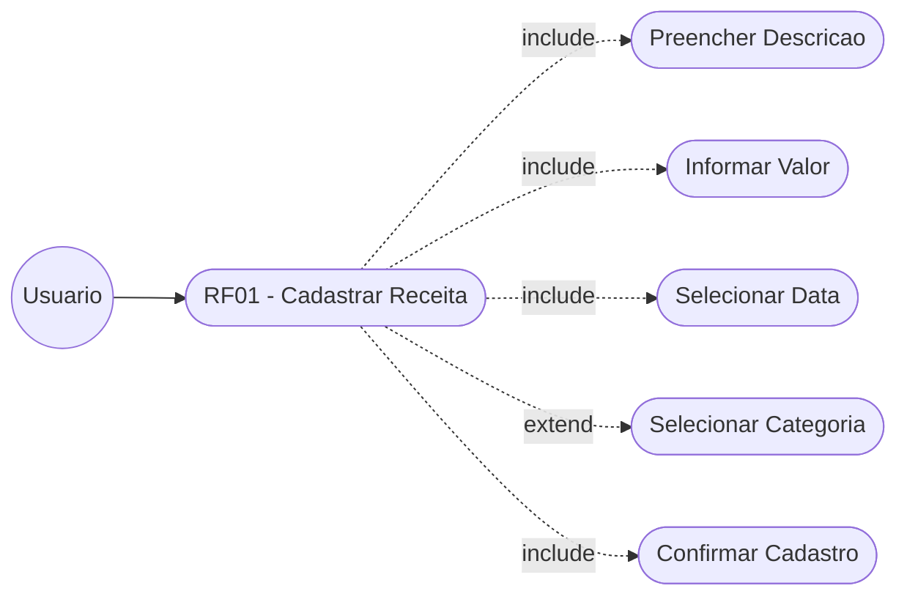
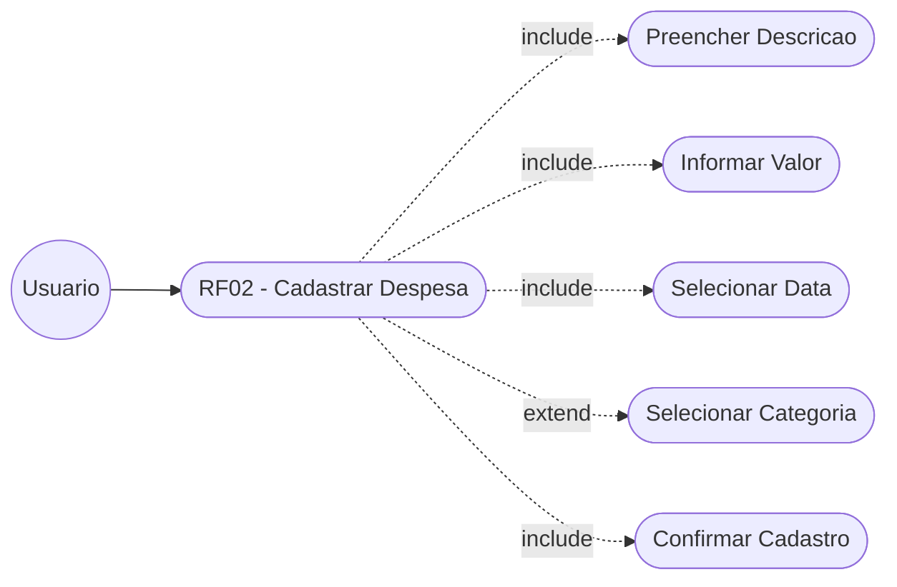
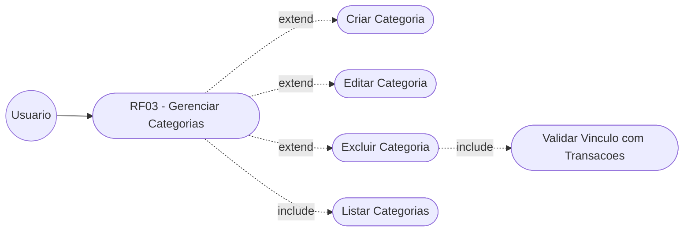
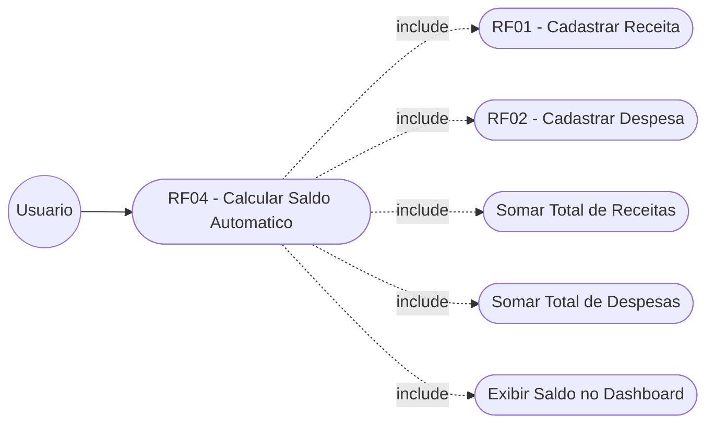
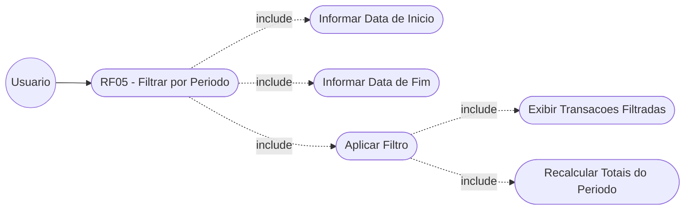
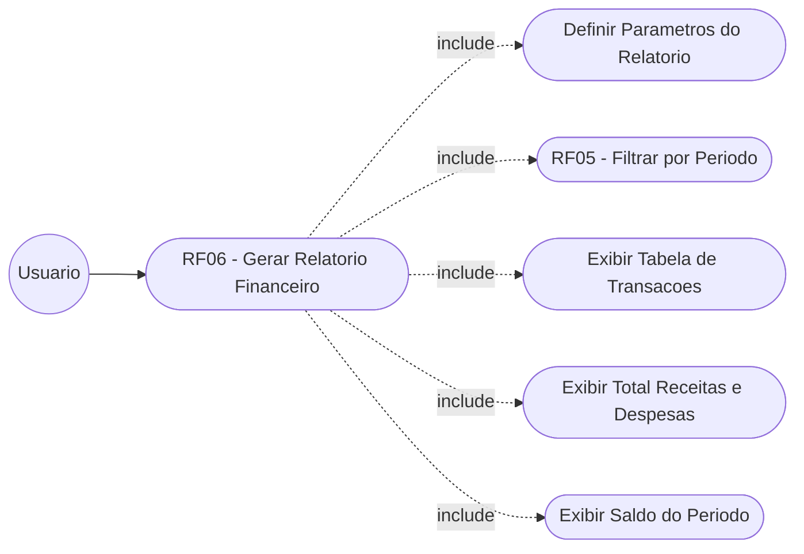
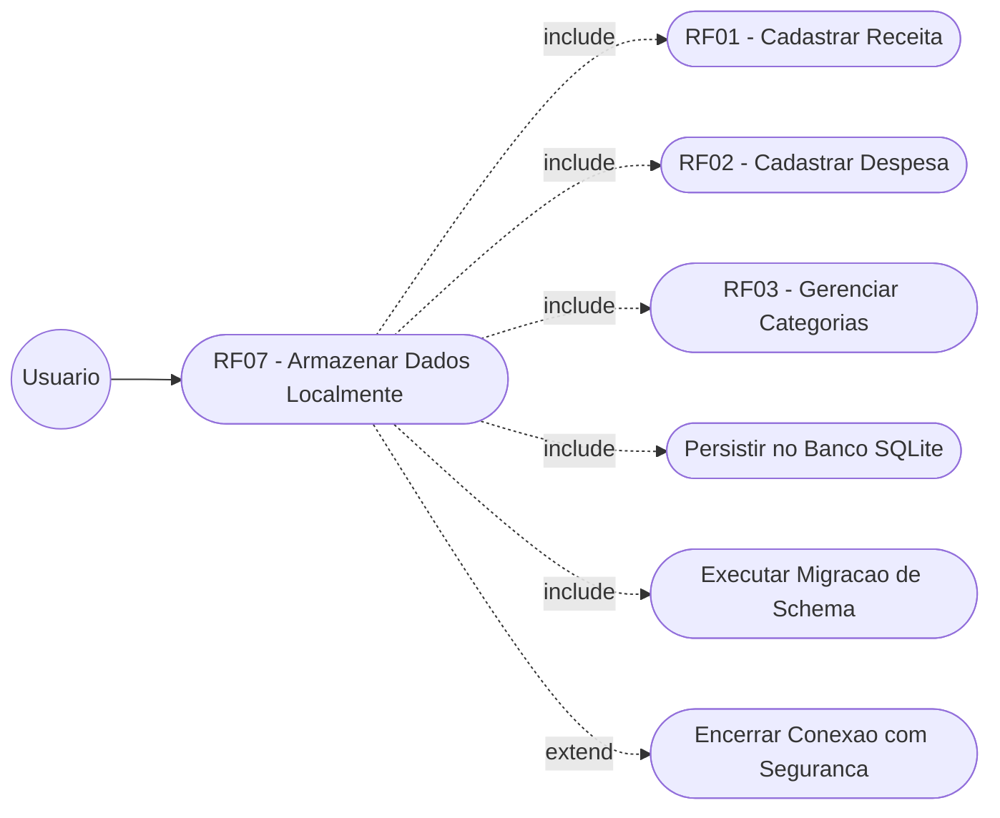
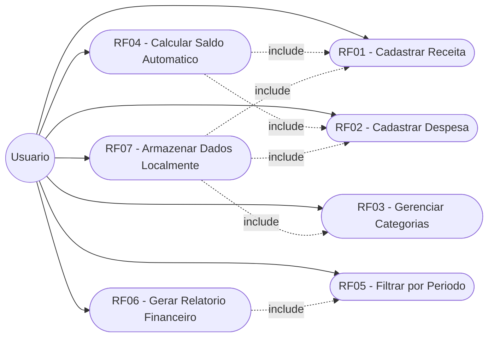

# Diagramas de Casos de Uso — Sistema Financeiro Pessoal (NEXA)

> Um diagrama por Requisito Funcional (RF), conforme solicitado.

---

## RF01 — Cadastrar Receita

> O usuário preenche os dados da receita (descrição, valor, data, categoria) e confirma o cadastro. O sistema valida e persiste a transação.

---

## RF02 — Cadastrar Despesa

> O usuário preenche os dados da despesa (descrição, valor, data, categoria) e confirma o cadastro. O sistema valida e persiste a transação.

---

## RF03 — Gerenciar Categorias

> O usuário pode criar, editar, listar e excluir categorias. A exclusão só é permitida se não houver transações vinculadas.

---

## RF04 — Calcular Saldo Automático

> O sistema calcula automaticamente o saldo (Receitas − Despesas) sempre que o dashboard é carregado ou atualizado. Depende de RF01 e RF02.

---

## RF05 — Filtrar Transações por Período

> O usuário informa a data de início e fim. O sistema filtra as transações e recalcula os totais do período selecionado.

---

## RF06 — Gerar Relatório Financeiro

> O usuário define o período e aciona a geração do relatório. O sistema utiliza o filtro por período (RF05) e exibe totais e tabela de transações.

---

## RF07 — Armazenar Dados Localmente

> O sistema persiste automaticamente todos os dados (transações e categorias) no banco SQLite local, sem necessidade de conexão com internet.

---

## Visão Geral — Todos os Casos de Uso

