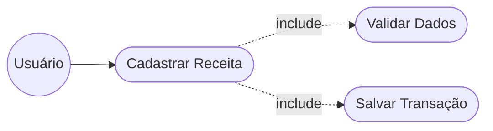
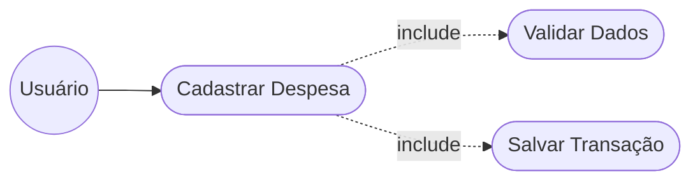
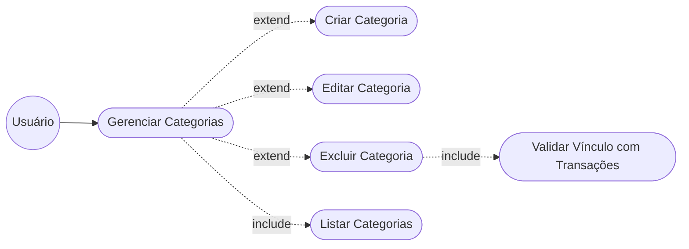
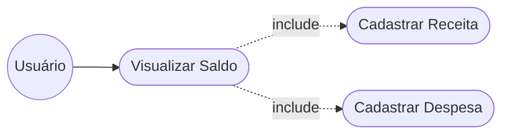
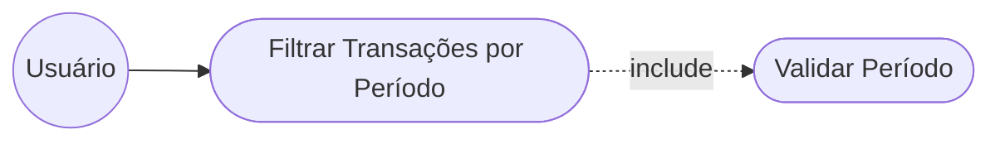
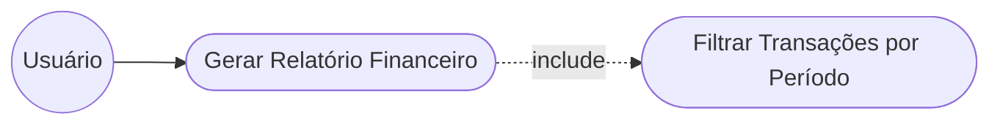
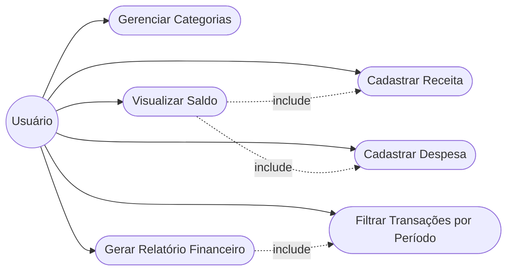

# Diagramas de Casos de Uso — Sistema Financeiro Pessoal (NEXA)

> Um diagrama por Requisito Funcional (RF), conforme solicitado.

---

## RF01 — Cadastrar Receita

> O usuário registra uma nova receita no sistema.

---

## RF02 — Cadastrar Despesa

> O usuário registra uma nova despesa no sistema.

---

## RF03 — Gerenciar Categorias

> O usuário pode criar, editar, excluir e visualizar categorias.

---

## RF04 — Visualizar Saldo

> O usuário visualiza o saldo calculado automaticamente com base nas receitas e despesas cadastradas.

---

## RF05 — Filtrar Transações por Período

> O usuário filtra as transações informando um intervalo de datas.

---

## RF06 — Gerar Relatório Financeiro

> O usuário gera um relatório financeiro com base em um período.

---

## Visão Geral — Todos os Casos de Uso

