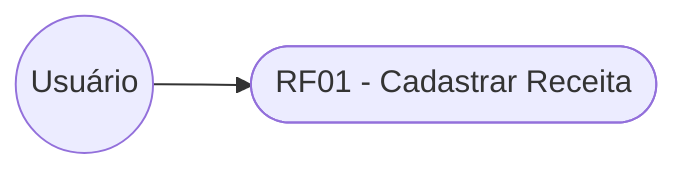
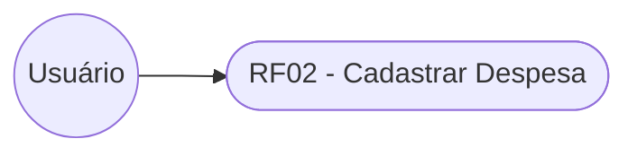
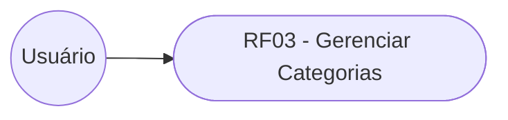
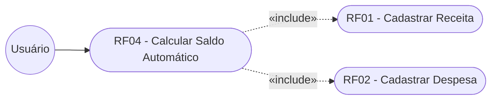
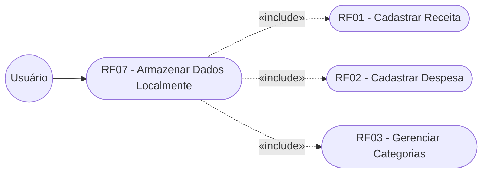
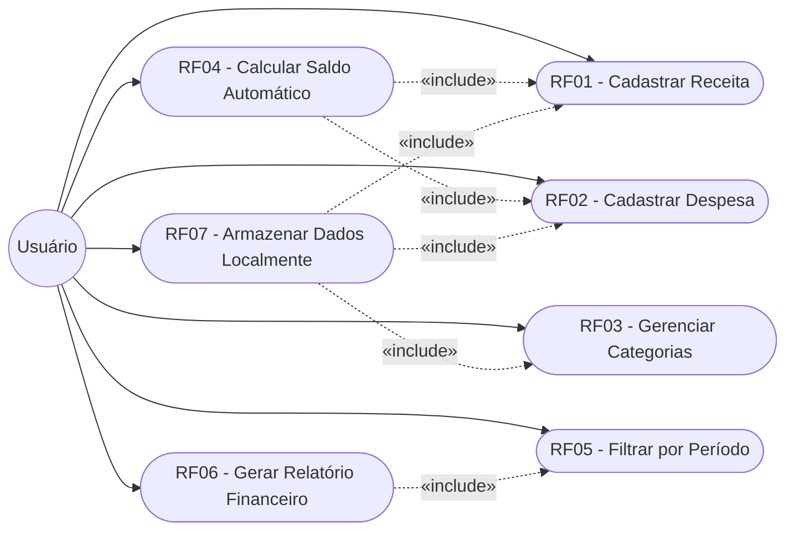

# Diagramas de Casos de Uso — Sistema Financeiro Pessoal (NEXA)

> Um diagrama por Requisito Funcional (RF), conforme solicitado.

---

## RF01 — Cadastrar Receita

---

## RF02 — Cadastrar Despesa

---

## RF03 — Gerenciar Categorias

> Engloba criar, listar, editar e excluir categorias.

---

## RF04 — Calcular Saldo Automático

> `«include»` RF01 e RF02 — o saldo depende das receitas e despesas cadastradas.

---

## RF05 — Filtrar Transações por Período

---

## RF06 — Gerar Relatório Financeiro

> `«include»` RF05 — o relatório utiliza o filtro de período.

---

## RF07 — Armazenar Dados Localmente

> `«include»` RF01 e RF02 — o armazenamento ocorre a cada operação de escrita.

---

## Visão Geral — Todos os Casos de Uso

