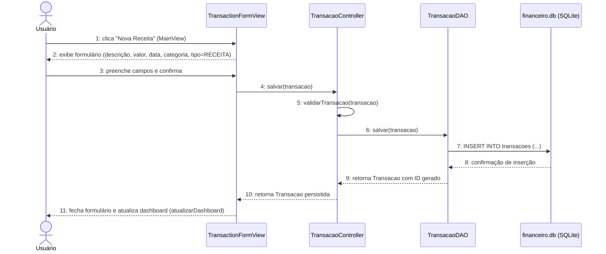
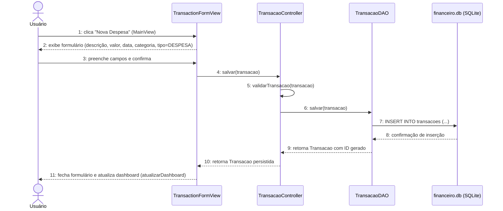
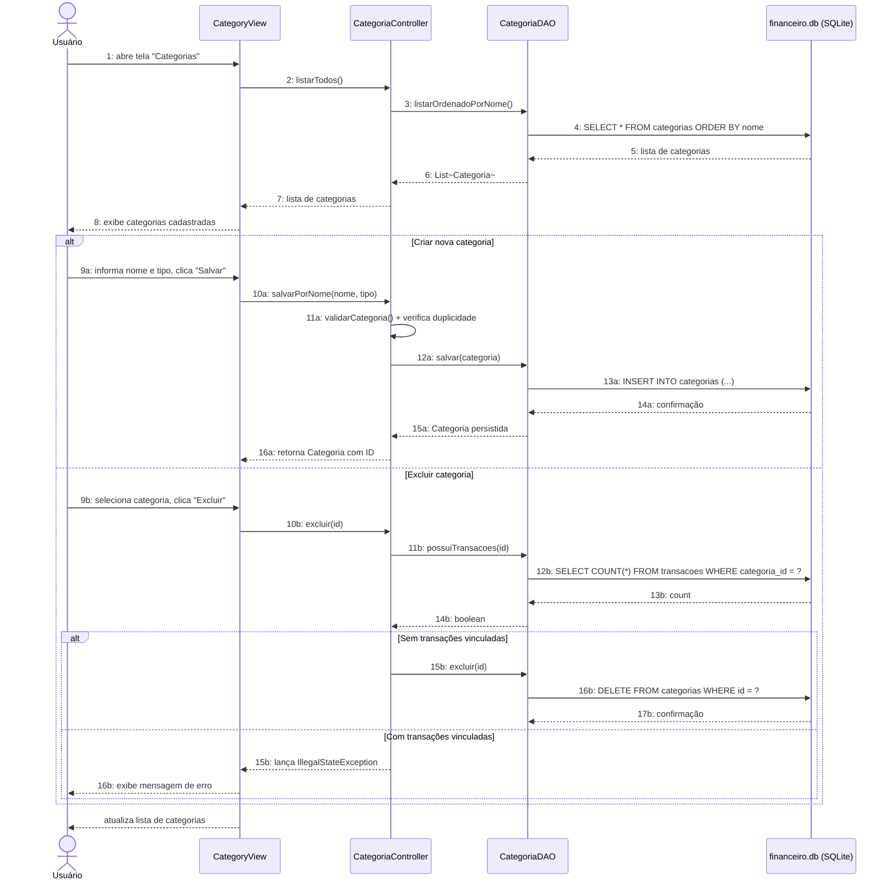
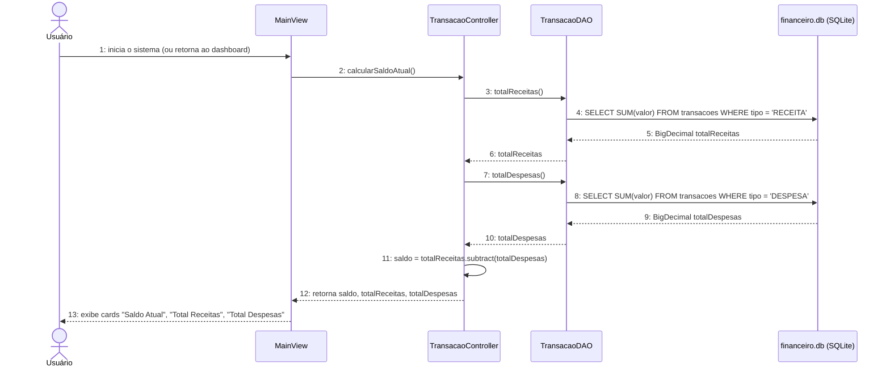
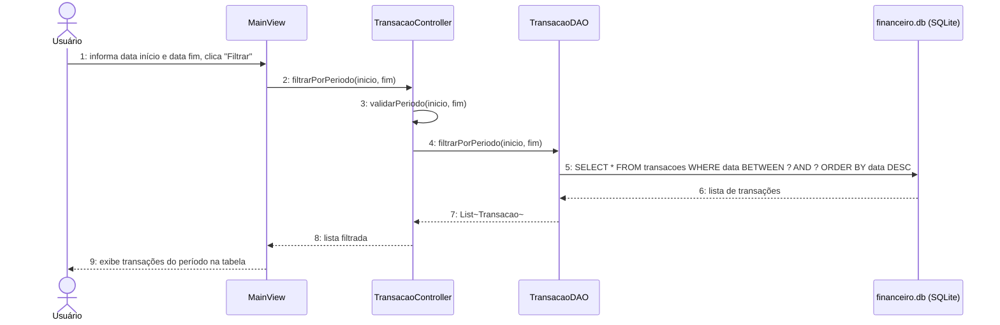
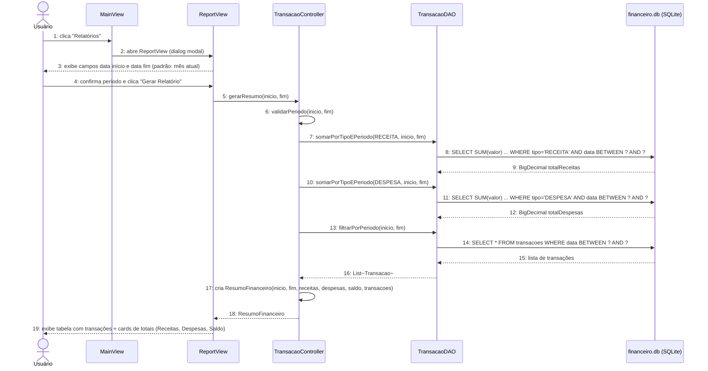
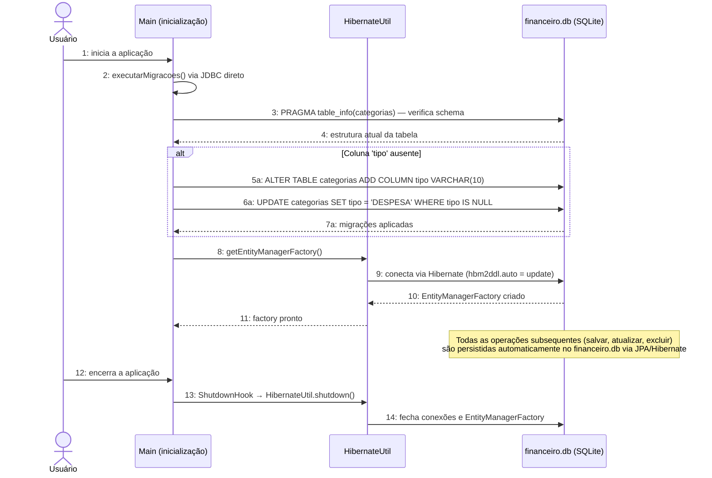

# Diagramas de Sequência — Sistema Financeiro Pessoal (NEXA)

> Um diagrama por Requisito Funcional (RF), conforme solicitado.
> Os participantes refletem as classes reais do projeto Java.

---

## RF01 — Cadastrar Receita

---

## RF02 — Cadastrar Despesa

---

## RF03 — Gerenciar Categorias

---

## RF04 — Calcular Saldo Automático

---

## RF05 — Filtrar Transações por Período

---

## RF06 — Gerar Relatório Financeiro

---

## RF07 — Armazenar Dados Localmente

